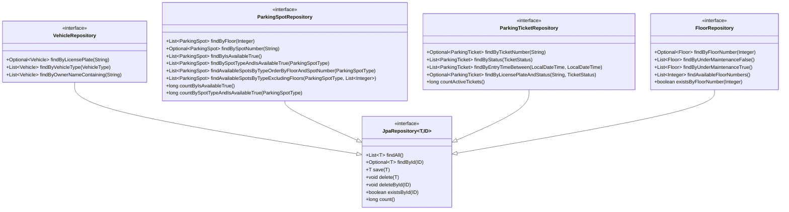
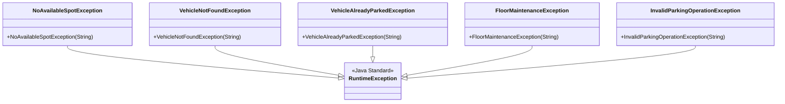

# 📊 Smart Parking Lot System - Class Diagrams

## Table of Contents
1. [Overview](#overview)
2. [Core Entity Classes](#core-entity-classes)
3. [Service Layer Classes](#service-layer-classes)
4. [Repository Layer Classes](#repository-layer-classes)
5. [Controller Layer Classes](#controller-layer-classes)
6. [DTO Classes](#dto-classes)
7. [Exception Classes](#exception-classes)
8. [Complete Class Relationship Diagram](#complete-class-relationship-diagram)

---

## Overview

This document provides comprehensive class diagrams for the Smart Parking Lot Management System, illustrating the relationships, dependencies, and structure of all major components.

### Class Diagram Notation
- **→** : Association/Dependency
- **◇** : Aggregation
- **◆** : Composition
- **▷** : Inheritance/Implementation
- **+** : Public
- **-** : Private
- **#** : Protected

---

## Core Entity Classes

### Vehicle Entity


### ParkingSpot Entity


### ParkingTicket Entity


### Floor Entity


---

## Service Layer Classes

### ParkingService


### ParkingSpotAllocationService


### FeeCalculationService


### FloorManagementService


---

## Repository Layer Classes

### Repository Interfaces


---

## Controller Layer Classes

### REST Controllers


---

## DTO Classes

### Request DTOs


### Response DTOs


---

## Exception Classes

### Custom Exceptions


---

## Complete Class Relationship Diagram

### System Overview


### Data Flow Diagram


### Package Structure

```mermaid
classDiagram
    namespace learn.spring.smart_parking_lot {
        class SmartParkingLotApplication
    }
    
    namespace learn.spring.smart_parking_lot.controller {
        class ParkingController
        class FloorManagementController
    }
    
    namespace learn.spring.smart_parking_lot.service {
        class ParkingService
        class ParkingSpotAllocationService
        class FeeCalculationService
        class FloorManagementService
    }
    
    namespace learn.spring.smart_parking_lot.repository {
        class VehicleRepository
        class ParkingSpotRepository
        class ParkingTicketRepository
        class FloorRepository
    }
    
    namespace learn.spring.smart_parking_lot.model {
        class Vehicle
        class ParkingSpot
        class ParkingTicket
        class Floor
        class VehicleType
        class ParkingSpotType
        class TicketStatus
    }
    
    namespace learn.spring.smart_parking_lot.dto {
        class VehicleEntryRequest
        class VehicleExitRequest
        class ParkingResponse
        class ParkingLotStatus
        class FloorStatus
        class MaintenanceModeDto
    }
    
    namespace learn.spring.smart_parking_lot.exception {
        class NoAvailableSpotException
        class VehicleNotFoundException
        class VehicleAlreadyParkedException
        class FloorMaintenanceException
    }
    
    namespace learn.spring.smart_parking_lot.config {
        class DataInitializer
    }
```


---

## Design Patterns in Class Structure

### 1. Repository Pattern


### 2. Service Layer Pattern


### 3. DTO Pattern


---

## Class Dependencies and Injection

### Dependency Injection Diagram


### Annotation-based Configuration
```mermaid
classDiagram
    class Component {
        <<annotation>>
    }
    
    class Service {
        <<annotation>>
    }
    
    class Repository {
        <<annotation>>
    }
    
    class Controller {
        <<annotation>>
    }
    
    class Autowired {
        <<annotation>>
    }
    
    class ParkingService {
        <<@Service>>
        <<@Transactional>>
        -VehicleRepository vehicleRepository <<@Autowired>>
    }
    
    Service --|> Component
    Repository --|> Component
    Controller --|> Component
    ParkingService --> Service
    ParkingService --> Autowired
```

---

This comprehensive class diagram documentation provides a complete view of the Smart Parking Lot system's structure, showing all classes, their relationships, dependencies, and how they work together to implement the business requirements. The diagrams use standard UML notation and are organized by architectural layers for easy understanding and maintenance.
